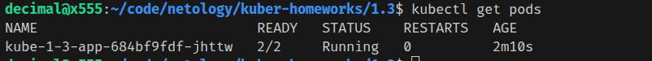
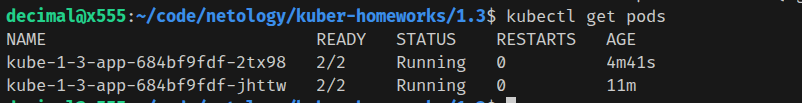

### Задание 1

**оба контейнера крутят nginx, который слушает порт 80. Можно либо конфиг энджинкса поменять в каком-то из контейнеров (через ConfigMap), либо взять другой образ multitool, в котором через env можно кастомизировать listening port у nginx: не 80, а 1180.**

### replicas: 1


### replicas: 2


### curl from multitool pod:

```bash
#делаем под
kubectl run multitool-checker --image wbitt/network-multitool:openshift
```


### Задание 2
