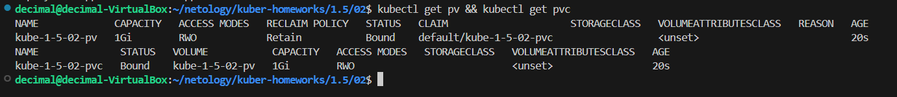
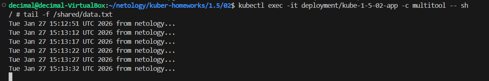
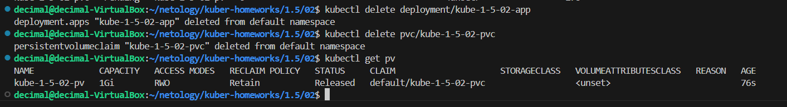
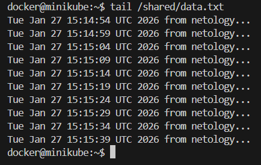
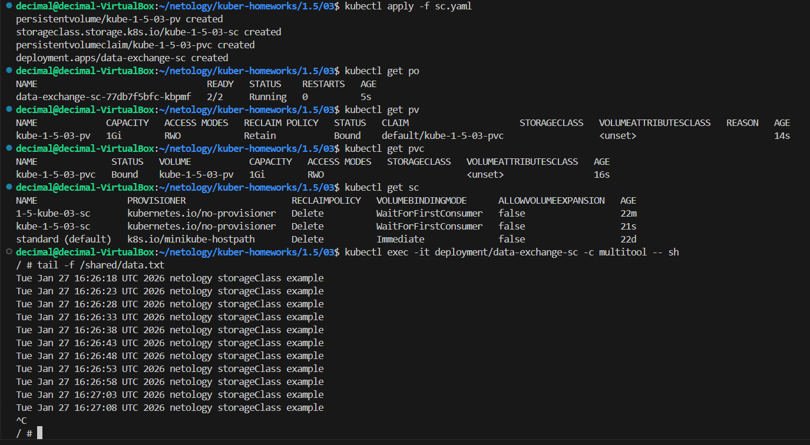

## Задание 1

### describe.yaml 
- [describe.yaml](./01/describe.yaml)

### tail -f


## Задание 2

### pv and pvc


### check file


```bash
# после удаления деплоя и pvc, pv не удаляется, потому что стоит retain в политике. Он переходит в состояние released.
```
### pv released


### файл остался на ноде. При использовании hostpath он останется и после удаления PV.


## Задание 3
