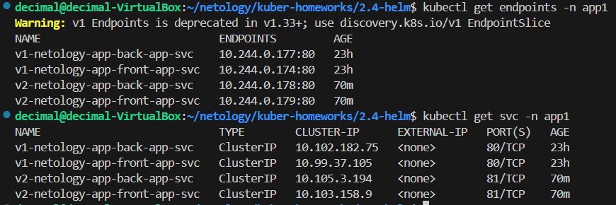
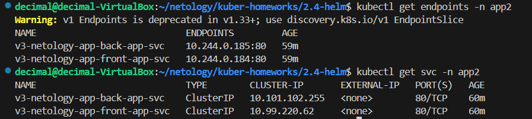
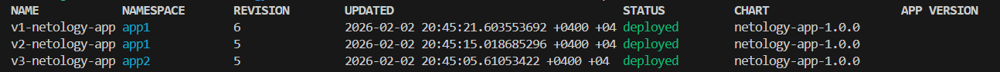
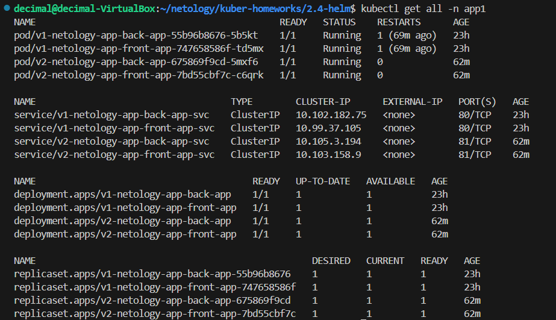
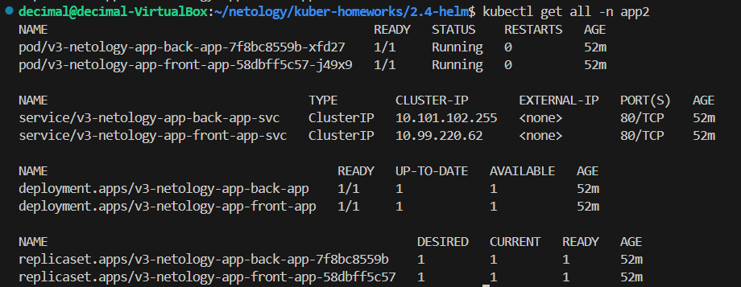
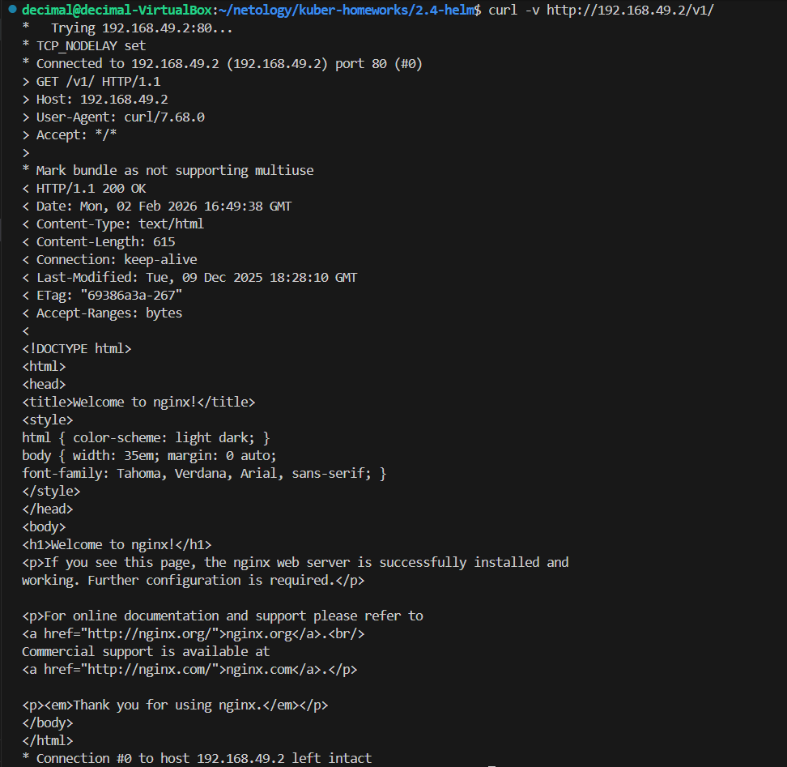

## 2.4 Helm homeworks

### helm install release
```bash
helm install v1-netology-app . --namespace app1 --set imageTag="stable-alpine" --set servicePort=80 --set ingressPath="v1"
helm install v2-netology-app . --namespace app1 --set imageTag="1.29.4" --set servicePort=81 --set ingressPath="v2"
helm install v3-netology-app . --namespace app2 --set imageTag="stable-alpine3.23" --set servicePort=80 --set ingressPath="v3"
```
### kubectl get endpoints -n app1 && kubectl get svc -n app1


### kubectl get endpoints -n app2 && kubectl get svc -n app2


### helm list --all-namespaces


### namespace app1


### namespace app2


### curl -v http://192.168.49.2/v1/

